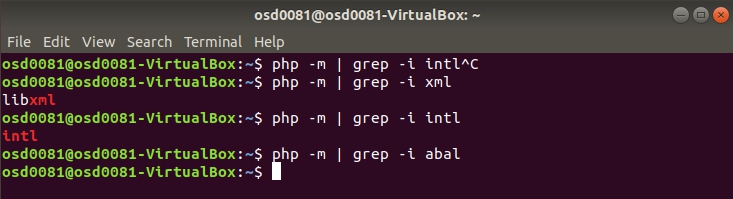

# LBE_Infra_2020

## A. Persiapan CodeIgniter

Ada beberapa hal yang perlu disiapkan sebelum kita bisa mendeploy web CodeIgniter. Hal-hal tersebut bisa kita lihat pada laman **[di sini](https://codeigniter.com/user_guide/intro/requirements.html)**. Berdasarkan laman tersebut ada 3 hal yang harus dipersiapkan sebelum bisa mendeploy web CodeIgniter, yakni:
-   Web Server
-   PHP
-   _Database Management System_

namun karna kita hanya harus mendeploy web CodeIgniter, maka DBMS bisa kita *sekip*.

### Persiapan Web Server
Web server yang kita gunakan kali ini bernama [APACHE](https://httpd.apache.org/), Untuk melakukan hal ini pertama kita update repositori kita dengan perintah :
```
sudo apt update
```
Jika diminta memasukan password, masukan password user. Jika sudah, masukan perintah dibawah untuk mengintall program apache-nya :
```
sudo apt install apache2 -y
```
Untuk menguji apakah sudah ter-install dengan benar, masukan kedalam domain bar :
```
localhost
```
Maka tampilannya akan seperti berikut jika berhasil.


Maka persiapan web server kita sudah siap.

### Persiapan PHP

Menggunakan perintah super user kita akan menginstall PHP, namun perlu diketahui dalam prasayarat CodeIgniter diharuskan agar kita menginstall beberapa ekstensi yakni:
-   php-intl
-   php-xml
-   php-mbstring
-   php-json
-   php-mbstring
-   php-mysql
-   php-curl

Ekstensi yang diatas beberapa tidak disediakan oleh directory PHP versi terbaru, untuk melakukan instalasi PHP dengan ekstensinya secara bersamaan dapat kita masukan kedalam terminal berupa perintah,
```
sudo apt install php libapache2-mod-php php-cli php-common php-mbstring php-gd php-intl php-xml php-mysql php-zip php-json php-curl -y
```
yang mana berarti,
```
sudo apt install <software> <software-nama.ekstensi> <software-nama.ekstensi> ... <software-nama.ekstensi>
```
Perintah **-y** menyatakan bahwa kita setuju untuk menginstal software yang kita download.

Terakhir, untuk memastikan bahwa ekstensi yang kita instal sudah tersedia gunakan perintah :
```
php -m | grep -i <nama.ekstensi>
```
Jika benar, maka akan muncul nama ekstensi tersebut seperti berikut.



Namun, jika tidak muncul apa-apa maka ekstensi belum terpasang.

## B. Mendeploy Web CodeIgniter

Sama seperti sebelumnya, hal yang kita lakukan adalah dengan menginstall CodeIgniter versi terbaru dengan terminal dari [github CodeIgniter](https://github.com/codeigniter4/CodeIgniter4/releases). Pada saat pembuatan ini versi terbarunya berupa 4.0.4.
```
wget -c https://github.com/codeigniter4/framework/archive/v4.0.4.tar.gz
```
Disini terminal akan mendownload frameworknya yang bernama c4.0.4.tar.gz alias CodeIgniter versi 4.0.4 dengan format tar.gz. Hal yang dilakukan selanjutnya adalah mengekstrak file tersebut dengan perintah berikut.
```
tar xzvf c4.0.4.tar.gz
```
Kemudian kita pindahkan ke directori html dan kita ubah namanya menjadi, misal, LBE_FP
```
sudo mv CodeIgniter4-4.0.2 /var/www/html/LBE_FP
```
Kemudian kita akses dengan perintah **cd** lalu tampilkan semua file yang ada dalam directory dengan perintah **ls** secara berturut-turut.
```
cd /var/www/html/LBE_FP
ls
```


Nantinya akan terlihat sebuah file bernama **spark**, dari situ kita langsung memasukan nama file tersebut kedalam terminal.
```
php spark serve
```
Akhirnya web CodeIgniter kita telah ter-_spark_ dan kita bisa mengakses web CodeIgniter tersebut melalui domain yang kita _spark_.


Lalu akses laman tersebut melalui web browser, jika berhasil maka akan muncul tampilan berikut.


Demikian maka web CodeIgniter telah terdeploy.
